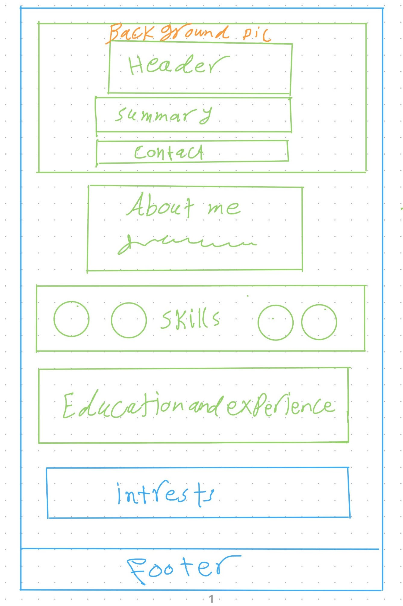

# Design

## Project's design overview

Asmaa's portfolio website follows a minimalist and lightweight design approach,
focusing on simplicity, elegance, and usability. The primary color is white,
ensuring a clean and professional look, complemented by a feminine secondary
color for accentuation. The typography will be modern and easy to read, aligning
with the minimalist aesthetic.

Key design decisions include:

Minimalist and light theme to maintain a professional and modern look.

Feminine secondary color to add personality and warmth.

Clean typography to enhance readability.

Well-structured sections to make information easily accessible.

Contact section with social media links and email for easy networking.

## Wireframe(s)

> Include your wireframe(s) and link to wireframe
> 
